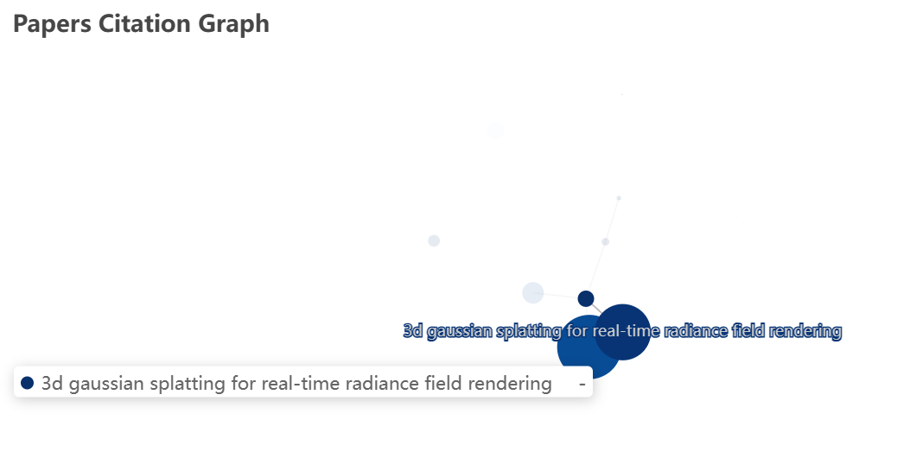

### 实验报告文档

---

#### 课程名称: [数据可视化]

#### 学生姓名: [吴立凡]

#### 学生学号: [SA23229104]

#### 实验题目: 开放学术论文数据的爬取与可视化

---

### 1. 实验目的

本实验旨在探索利用网络爬虫技术获取开放学术论文数据，并利用数据可视化工具对论文引用关系进行可视化分析。通过完成该实验，期望达到以下目标：

- 理解网络爬虫的基本原理和操作流程。
- 掌握利用Python编写网络爬虫程序的方法。
- 学习使用数据可视化工具对论文引用关系进行可视化分析。

### 2. 实验环境

- 操作系统：Windows 10
- 开发工具：PyCharm、Visual Studio Code
- 编程语言：Python 3.8
- 第三方库：Selenium、BeautifulSoup、Pyecharts、Matplotlib

### 3. 实验步骤

#### 3.1 网络爬虫程序编写

- 使用Selenium库模拟浏览器操作，访问Google Scholar网站，并利用搜索功能获取论文列表页的HTML内容。
- 使用BeautifulSoup库解析HTML内容，提取论文的标题、作者、引用次数、发布年份等信息。
- 实现多页搜索结果的自动翻页功能，确保获取足够的论文数据。
- 将获取的论文数据保存为JSON格式文件，便于后续处理和分析。

#### 3.2 数据可视化

- 使用Pyecharts库创建图表，将论文数据转换为节点和边的形式，构建论文引用关系图。
- 设计合适的节点大小和颜色，以及边的连接方式，展示论文之间的引用关系。
- 将生成的论文引用关系图保存为HTML文件，便于浏览和分享。

### 4. 实验结果与分析

在实验过程中，我花费了大量时间在爬虫部分，因为我遇到了多种反爬虫机制，必须想办法克服这些困难。
首先，我使用了Selenium框架模拟人类对网页的点击，以绕过一些使用requests库的爬虫的屏障。此外，在每次点击之前，我都设置了几秒的暂停，以模仿真人操作，避免爬取频率过快导致封号。
我还限制了爬取页面的上限为二，以避免访问次数过多导致封号。
在实验过程中，我多次因爬取频率过高而被封号，不得不更换IP和节点来解决这个问题。
而且每一次的爬取之前都需要进行谷歌的人机验证，这也为我的实验带来了很大的困难。

- 成功获取了Google Scholar上的论文数据，包括标题、作者、引用次数和发布年份等信息。
- 利用论文数据构建了引用关系图，清晰展示了论文之间的引用关系。
- 通过节点大小和颜色的设置，可以直观地了解论文的引用量和发布时间。
- 把鼠标悬停在节点上，可以查看论文的详细信息，包括标题、作者和引用次数等。

### 5. 实验总结与思考

本次实验通过网络爬虫技术获取了开放学术论文数据，并利用数据可视化工具进行了可视化分析。在实践过程中，遇到了一些问题，例如网站反爬机制、页面结构变化等，通过查阅文档和调试代码逐步解决。同时，也深刻认识到数据可视化的重要性，通过图表和图形直观地展示数据，有助于我们更深入地理解数据背后的规律和趋势。在今后的学习和工作中，将继续探索数据分析和可视化技术，提升数据处理和解读能力。

### 6. 参考文献

[1] Python官方文档：https://www.python.org/doc/

[2] Selenium官方文档：https://www.selenium.dev/documentation/en/

[3] BeautifulSoup官方文档：https://www.crummy.com/software/BeautifulSoup/bs4/doc/

[4] Pyecharts官方文档：https://pyecharts.org/#/zh-cn/

[5] Matplotlib官方文档：https://matplotlib.org/stable/contents.html

